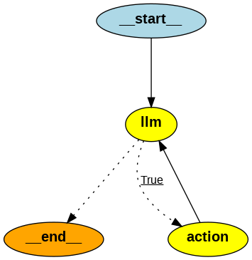

# rag-app

A Retrieval-Augmented Generation (RAG) application made with LangChain, Tavily, FastAPI, and React.

This application uses LangGraph to create a multi-tool agent that can perform multiple Internet searches to various services of the LLM's choosing both in parallel and in serial to find what it needs to answer the user's query.



# Setup

Once you've cloned this repository locally, you'll need to provide the application with API keys to interact with OpenAI, Tavily, and Wolfram Alpha. To do this, copy the `.env.example` file in the `backend` directory into a new file called `.env` and populate it with your own OpenAI key, Tavily API key, and Wolfram Alpha App ID. You can aquire these here:

- OpenAI API key: https://platform.openai.com/api-keys
- Tavily API key: https://app.tavily.com/
- Wolfram Alpha App ID: https://developer.wolframalpha.com/access

 To enable tracing with LangSmith, fill in your LangChain API key and project name here. You can set these up and view tracing here:
 - LangSmith: https://smith.langchain.com/

# Usage

In the root of the project, run:

```
docker compose up --build
```

Once running, navigate to http://localhost:5173 in your browser.
